# (C# 코딩) EchoMessenger

## 개요
- C# 프로그래밍 학습
- 1줄 소개: 사용자의 키보드 입력을 받아 문자열 데이터를 정제하고, 대화창에 시간 정보와 함께 실시간으로 출력 및 관리하는 에코 메신저 프로그램입니다.
- 사용한 플랫폼:
  - C#, .NET Windows Forms, Visual Studio, GitHub
- 사용한 컨트롤:
  - Label, TextBox, ListBox, Button
- 사용한 기술과 구현한 기능:
  - Visual Studio를 이용하여 UI를 직관적인 메신저 형태로 디자인하고, 각 컨트롤의 이름을 명명 규칙에 맞게 변경하여 가독성을 높였습니다.
  - string 클래스의 Trim(), IsNullOrWhiteSpace() 메서드와 Length 속성을 활용하여 사용자 입력 문자열의 공백 제거, 빈 줄 전송 방지, 50자 제한 검사 등 다양한 예외 상황을 처리했습니다.
  - DateTime.Now.ToString() 메서드와 C# 문자열 보간법($"")을 결합하여, 메시지가 리스트에 추가될 때 현재 시간 정보(타임스탬프)가 자동으로 텍스트에 포함되도록 구현했습니다.
  - ListBox 컨트롤의 Items.Add(), RemoveAt(), Clear(), Count 속성 및 메서드를 적극적으로 제어하여 채팅 추가, 선택 삭제, 전체 대화 기록 초기화, 실시간 메시지 카운팅 기능을 완성했습니다.
  - 폼 로드 시 폼의 Text 속성을 변경하여 제목을 설정하고, 리스트 항목 갱신 시 SelectedIndex를 제어하여 최신 채팅으로 스크롤이 따라가게 하는 등 섬세한 사용자 경험(UX)을 적용했습니다.

## 실행 화면 (과제1)
- 과제1 코드 실행 스크린샷

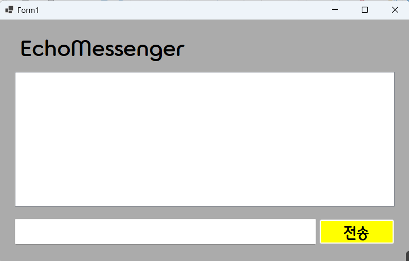

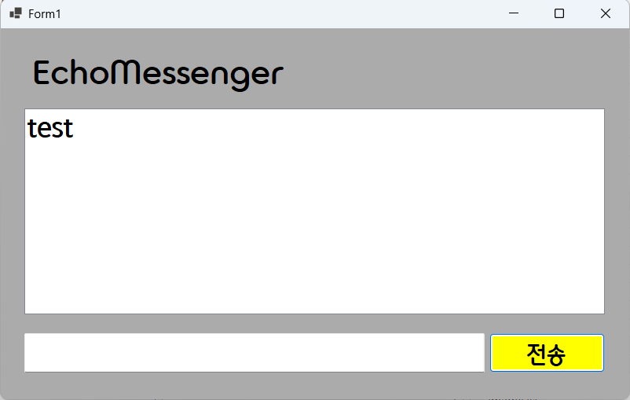

- 과제 내용
  - Label(표시), TextBox(입력), Button(전송), ListBox(대화창)를 메신저 구조에 맞게 적절히 배치 
  - 전송 버튼 클릭 시 TextBox의 텍스트를 ListBox의 항목(Items)으로 추가
  - 추가 직후 TextBox의 내용을 비워(Clear) 다음 입력을 준비

- 구현 내용과 기능 설명
  - 화면 중앙에 채팅 기록이 보일 넓은 ListBox(lstChat)를 배치하고, 하단에 사용자가 메시지를 입력할 TextBox(txtInput)와 전송을 담당하는 Button(btnSend)을 배치하여 기초적인 윈도우 메신저 폼 레이아웃을 구성했습니다.   
  - 전송 버튼(btnSend)의 Click 이벤트 핸들러를 작성하여, 버튼을 누를 때마다 txtInput.Text에 담긴 문자열을 변수에 저장한 뒤 lstChat.Items.Add() 메서드를 사용하여 리스트 박스에 메시지가 한 줄씩 누적 출력되도록 핵심 기능을 구현했습니다.    
  - 메시지가 정상적으로 리스트에 추가된 직후에는, 사용자가 기존 내용을 백스페이스로 지울 필요 없이 곧바로 다음 채팅을 입력할 수 있도록 txtInput.Clear() 메서드를 호출하여 입력창을 깨끗하게 비워주었습니다.  

## 실행 화면 (과제2)
- 과제2 코드 실행 스크린샷

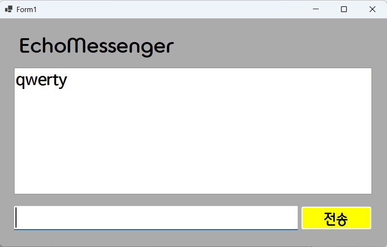

- 과제 내용
  - 입력창의 기존 메시지 지우기 및 입력창에 포커스(Focus) 갖다 놓기
  - 마우스 클릭 대신 Enter키로 채팅 전송하기
  - 내용이 없는 빈 문자열이나 공백(Space)만 있을 때 전송을 막는 논리적 입력 방어 기능 적용

- 구현 내용과 기능 설명
  - 메시지 전송 후 마우스를 텍스트 창으로 다시 클릭해야 하는 번거로움을 해결하기 위해, 코드 마지막에 txtInput.Focus() 메서드를 호출하도록 추가했습니다. 이를 통해 사용자가 폼 화면의 다른 곳을 누르지 않아도 커서가 입력창에 자동으로 머물러 연속적인 채팅이 가능해졌습니다.
  - 텍스트 박스의 KeyDown 이벤트를 활성화하여 e.KeyCode == Keys.Enter 조건문으로 사용자가 누른 키가 엔터(Enter) 키인지 감지하도록 했습니다. 엔터키 입력 시 마우스 클릭과 동일하게 동작하도록 btnSend_Click 메서드를 호출하고, 윈도우 기본 알림음(띵 소리)이 나지 않도록 e.Handled = true;를 추가하여 깔끔한 엔터키 전송을 완성했습니다.
  - 의미 없는 빈 줄이나 공백 도배를 원천 차단하기 위해, 전송 로직 상단에 string.IsNullOrWhiteSpace() 메서드를 사용한 방어 코드를 작성했습니다. 입력된 텍스트가 비어 있거나 여백만 존재할 경우 return;을 통해 함수를 즉시 종료시켜 ListBox에 등록되지 않게 처리했습니다.

## 실행 화면 (과제3)
- 과제3 코드 실행 스크린샷

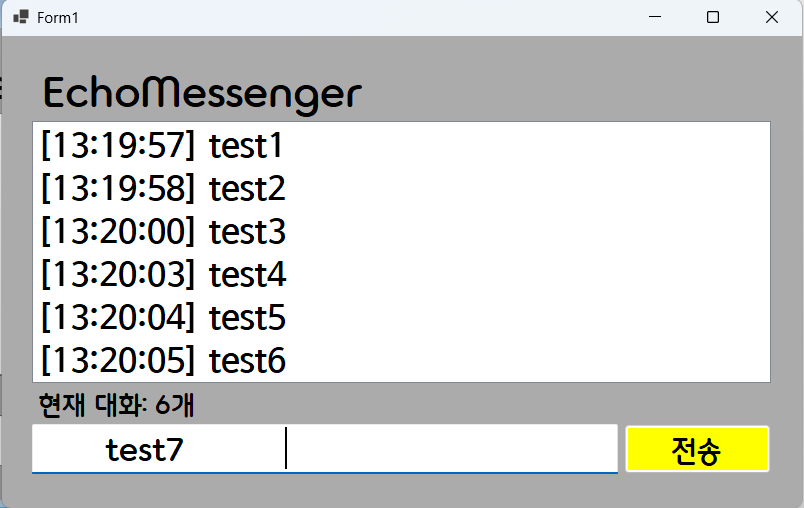

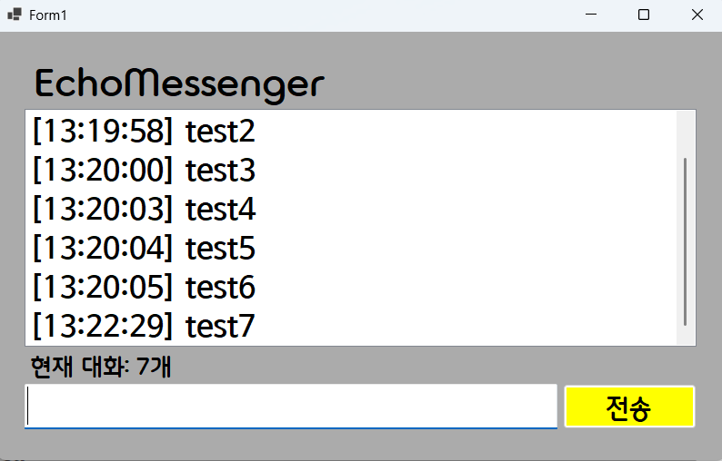

- 과제 내용
  - 대화 리스트에 메시지 출력 시 타임스탬프(현재 시간) 문자열 결합 추가
  - 현재 리스트에 쌓인 총 메시지 개수를 실시간으로 카운팅하여 하단 Label에 업데이트
  - 사용자가 입력한 메시지의 앞뒤 불필요한 공백을 제거하는 문자열 정제 처리

- 구현 내용과 기능 설명
  - 사용자의 조작 실수로 인해 메시지 앞뒤에 의도치 않은 공백이 포함될 경우를 대비하여 string 클래스의 Trim() 메서드를 사용했습니다. 이를 통해 앞뒤 여백이 깨끗하게 정제된 순수한 텍스트 데이터만 화면에 출력되게끔 가공했습니다.  
  - 단순히 내용만 보여주는 것을 넘어 DateTime.Now.ToString("HH:mm:ss") 형식 지정자를 활용해 실시간 시각 데이터를 받아왔습니다. 여기에 문자열 보간법($"")을 사용하여 [14:20:05] 입력내용 형태로 타임스탬프와 사용자 메시지가 깔끔하게 하나의 문장으로 병합되어 리스트 박스에 들어가도록 고도화했습니다.   
  - 채팅방에 쌓인 기록 개수를 한눈에 볼 수 있도록 lstChat.Items.Count 속성으로 리스트 아이템의 총개수를 산출했습니다. 전송 혹은 삭제 이벤트가 발생할 때마다 하단에 배치된 상태 표시 라벨(lblCount)의 Text 속성을 $"현재 대화: {lstChat.Items.Count}개"로 갱신하여 실시간 상태 표시 시스템을 구축했습니다.  

## 실행 화면 (과제4)
- 과제4 코드 실행 스크린샷

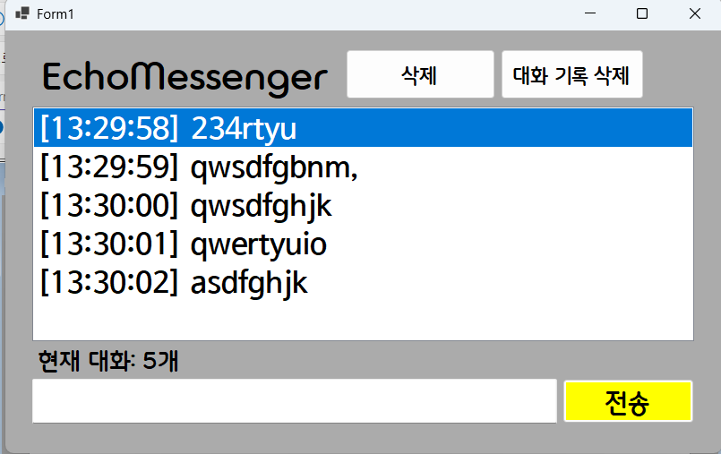

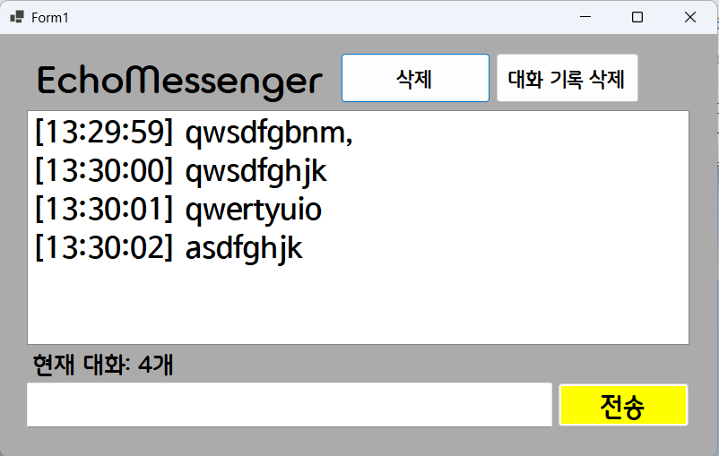

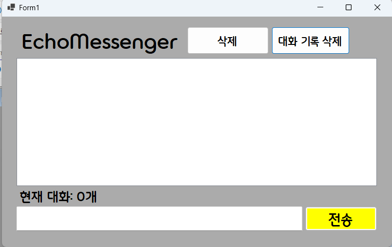

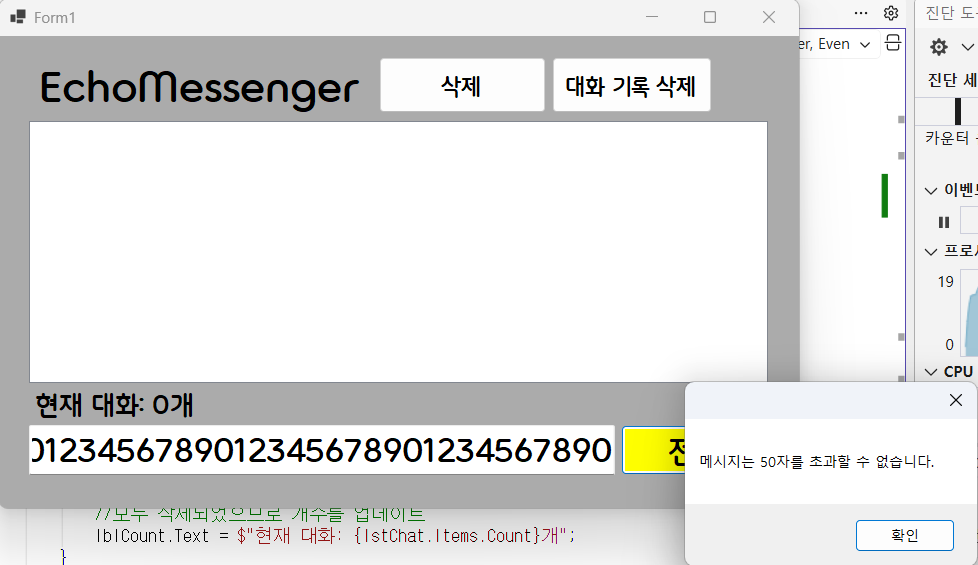

- 과제 내용
  - 특정 메시지를 선택하여 삭제하는 선택 항목 삭제 (선택하지 않았을 때 발생하는 에러 예외 처리 포함)
  - 리스트의 모든 내용을 한 번에 지워주는 대화 기록 전체 초기화 기능 구현
  - 입력창 글자 수를 50자로 제한하고 초과 시 사용자에게 경고 메시지를 띄우고 전송 차단

- 구현 내용과 기능 설명
  - 폼에 별도의 삭제 버튼(btnDelete)을 배치한 후 lstChat.SelectedIndex 속성을 통해 사용자가 마우스로 선택한 항목이 있는지 판별했습니다. 유효한 항목 위치를 찾으면(!= -1) RemoveAt() 메서드를 호출해 선택된 줄만 핀포인트로 삭제하고, 미선택 상태에서 누를 경우 런타임 오류로 프로그램이 종료되지 않도록 MessageBox.Show()로 안내 창을 띄우는 안전한 예외 처리를 설계했습니다.  
  - 쌓여있는 모든 데이터를 일괄 삭제하는 전체 초기화 버튼(btnAllDelete)을 연동했습니다. 해당 버튼 클릭 시 Items.Clear() 메서드가 호출되어 리스트 박스가 완전히 비워지며, 직후 대화 개수 표시 라벨 역시 0개로 정상 동기화되도록 조치했습니다.
  - 악의적으로 긴 텍스트를 입력하여 레이아웃을 망치는 것을 방지하기 위해 입력 문자열의 Length 속성 검사를 도입했습니다. 50자를 초과할 경우 "메시지는 50자를 초과할 수 없습니다."라는 경고 박스를 출력한 후 전송 코드가 실행되지 못하게 return으로 차단하여 강력한 데이터 관리 규칙을 수립했습니다.

## 실행 화면 (추가사항)
- 추가사항 코드 실행 스크린샷

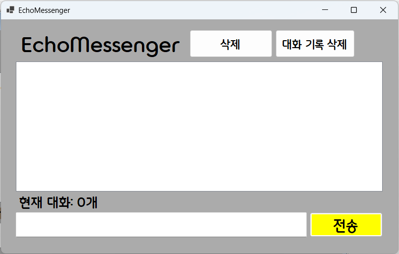

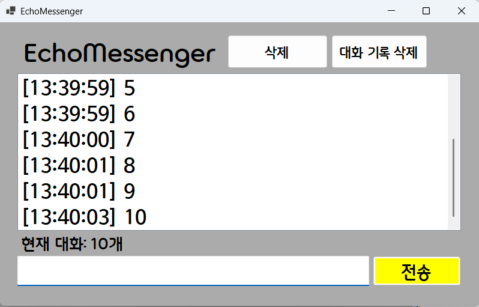

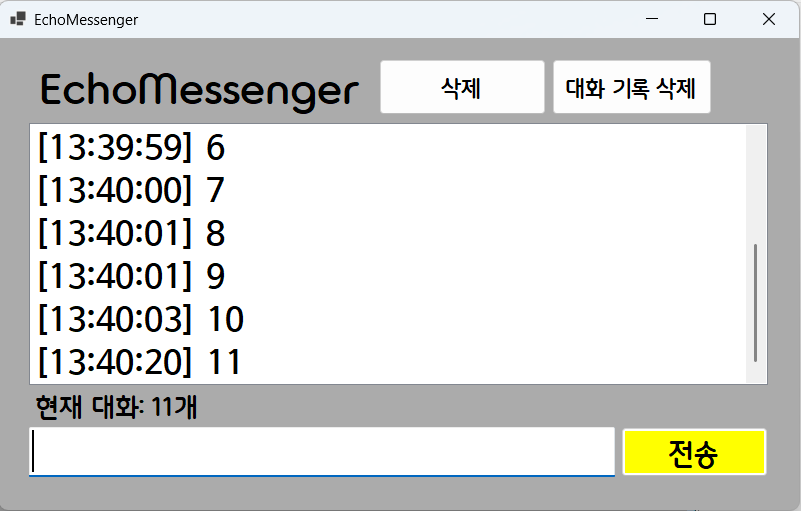

- 과제 내용
  - 폼 제목(Form Title) 동적 변경 및 추가
  - 채팅이 쌓였을 때 최신 대화 목록으로 따라가는 자동 스크롤(Auto Scroll) 구현

- 구현 내용과 기능 설명
  - 애플리케이션 실행 시 진입점인 Form1_Load 이벤트를 생성하여, this.Text = $"EchoMessenger"; 코드를 통해 윈도우 창 상단 타이틀바의 이름을 기본값에서 메신저의 목적에 맞는 직관적인 이름으로 자동 설정되도록 개선했습니다.
  - 텍스트 항목이 리스트 박스의 세로 범위를 넘어갈 때, 매번 스크롤바를 마우스로 내려야 하는 불편함을 해소하기 위해 전송 버튼 코드 안에 동적 스크롤 기능을 포함했습니다. 데이터가 Add된 직후, lstChat.SelectedIndex = lstChat.Items.Count - 1; 명령어로 가장 밑에 위치한 최신 메시지로 포커스를 맞추어 스크롤이 자동으로 따라가게 만들고, 파란색 선택 하이라이트가 남지 않도록 곧바로 lstChat.SelectedIndex = -1;을 할당하여 훨씬 부드럽고 자연스러운 메신저 사용 경험을 제공했습니다.